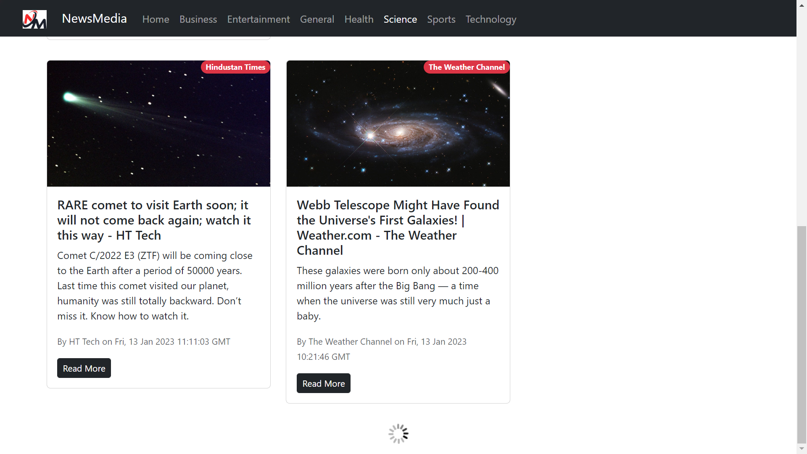

# NewsMedia React App

NewsMedia is a React app that uses the News API to fetch news articles from various sources. It is a single page application that uses React Router to navigate between different pages.

### Features

1. [X] View news articles from various sources
2. [X] View news articles from a specific source
3. [X] View news articles from a specific category
4. [X] View news articles from a specific date
5. [X] View news articles from a specific source and category
6. [X] View news articles from a specific source and date
7. [X] View news articles from a specific category and date
8. [ ] View news articles from a specific source, category and date
9. [ ] View news articles from a specific country
1. [ ] View news articles from a specific country and category

### Technologies Used

- React
- React Router
- React Hooks
- React Bootstrap
- News API

### API Reference

- [News API](https://newsapi.org/)
- [News API Documentation](https://newsapi.org/docs)

## Getting Started to run the Web-Application

### Method 1: Running the Web-Application on your local machine by installing the dependencies and your API key

### 1. API Key

- [Get your API key](https://newsapi.org/register)
- Go to `src/App.js` and replace `process.env.REACT_APP_NEWS_API_KEY` with your API key

### 2. Installation

#### `npm install`

Installs all the dependencies required to run the app.

### 3. Run the Web-Application

#### `npm start`

Runs the app in the development mode.
Open [http://localhost:3000](http://localhost:3000) to view it in your browser.

The page will reload when you make changes.
You may also see any lint errors in the console.

### Method 2: By running the Build folder with Live Server (VS Code Extension) or any other server on localhost

1. Open the Build folder in VS Code
2. Install Live Server Extension
3. Select Open with Live Server from the context menu only*
4. The Web-Application will be running on localhost

### Screenshots of the Web-Application

